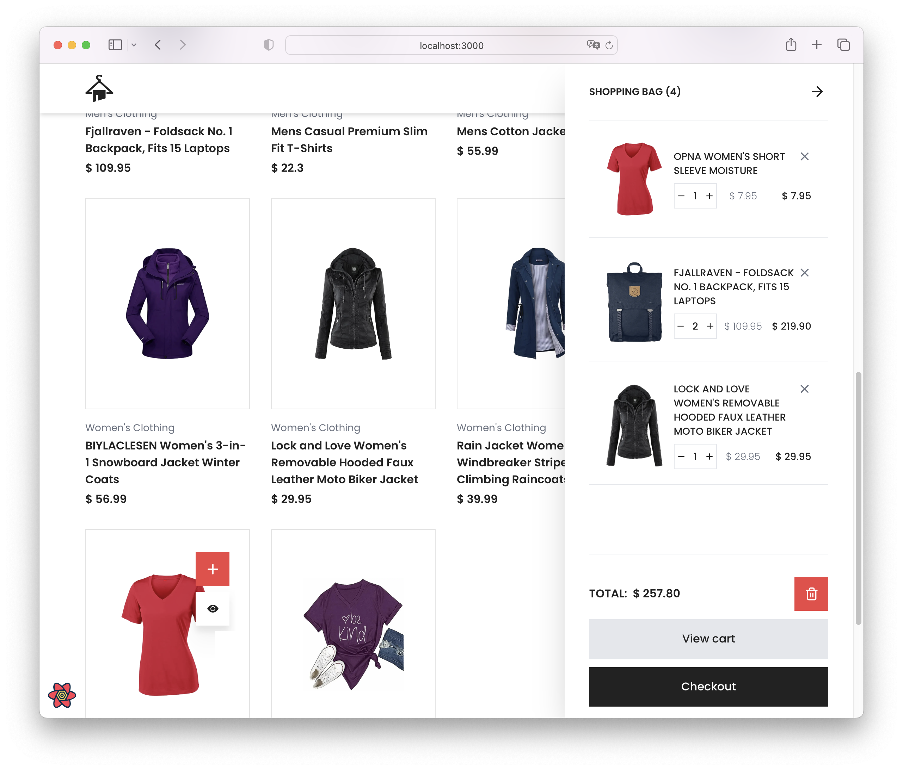
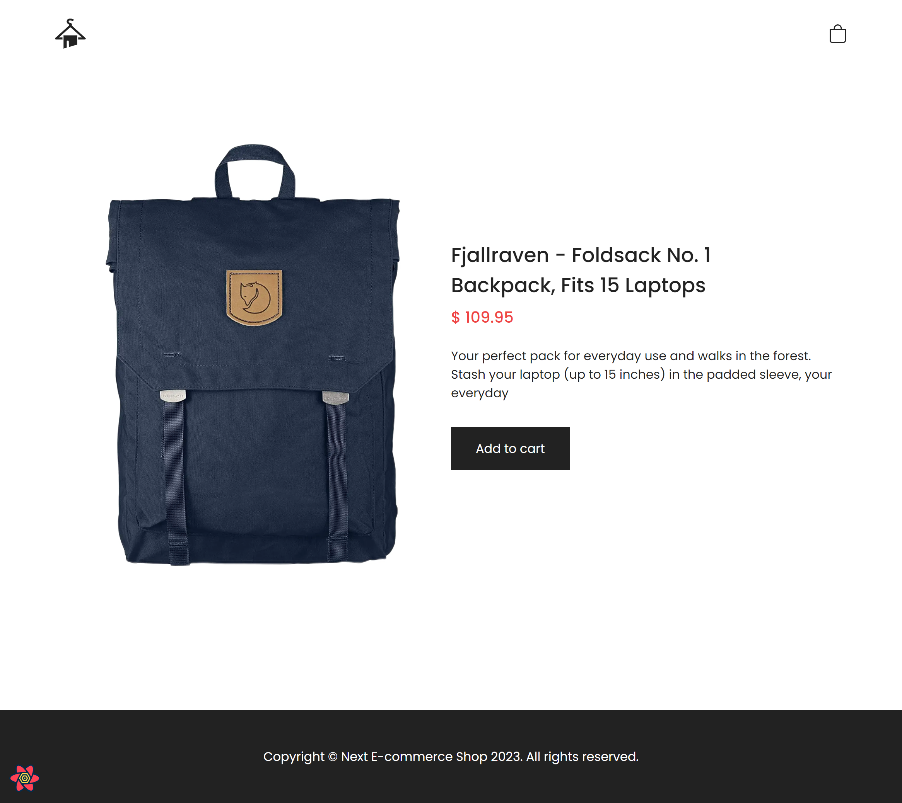

## Getting Started



First, run the development server:

```bash
pn dev
```

Open [http://localhost:3000](http://localhost:3000) with your browser to see the result.

## Screenshots

Desktop version:


Mobile version:


Product page:


